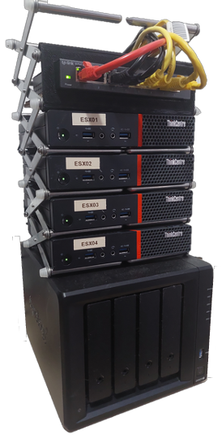

# Homelab
Homelab IaC - Running on proxmox
  
- Terraform
- Ansible
- Kubernetes

## A Homelab can be anything

- tp-link 8 Port Switch
- 4 x ThinkCentre M900 i5's
- Synology NAS DS920+
- 2 x IKEA VARIERA Pot Lid Organiser's 

  

